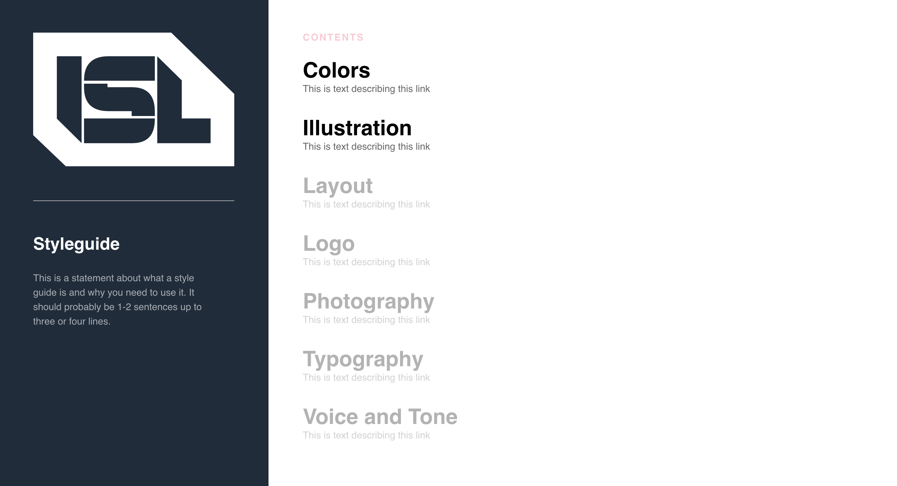

# styleguide-base


A base project for all of your styleguide needs!
Intended to be able to be used by the not so technical and technical to quickly get a styleguide site up.

## Requirements
- Node
- NPM
- (If you're unfamiliar with either of those let a dev know and we will help you get setup)

We also highly encourage you use [VSCode](https://code.visualstudio.com/) for working on the project as
it's the easiest way to get a terminal and code editor all running at the same time, while also getting
all of the modern tools we developers use to make editing all the easier.

## Development
Run the following to get the server up and running!
```bash
nvm use
npm install
npm run start
```

## Usage
#### Lay of the land
- src: The directory where all the magic happens
    - src/assets: Where all static assets like fonts, images, downloads, etc. all belong
    - src/components: All usable "blocks" and "components" that can go on each page
    - src/page_templates: The base page templates to be copy pasted into "pages" for building the site!
    - src/pages: ***All files here resolve to a url at their name - i.e. colors.js would result in www.{SITE}.com/colors. This is where 99% of the work you do will be done!***
    - src/styles: Where custom css can be included (it will need to be imported to be actually used)
    - src/utils: This is the land where the light does not touch 🦁🛑 Enter at your own risk if you are not a developer!

- gatsby-config.js: This is the file where a majority of the site configuration is done. Title, home page blocks, etc.

#### Making a new page
Super simple. Follow this easy three step process:

1. Find the page template you want in src/page_templates
2. Copy it into pages
3. Edit and remove blocks as desired! We recommend you stick within the framework of the example blocks if you are very
new to programming (i.e. do a lot of copy pasting), but technically you can get really custom with anything and everything.

## Troubleshooting
- All assets in the asset folder need to be named unique names. Even those files in sub-folders need to be unique.

## Deployment
[](https://heroku.com/deploy?template=https://github.com/istrategylabs/styleguide-base)